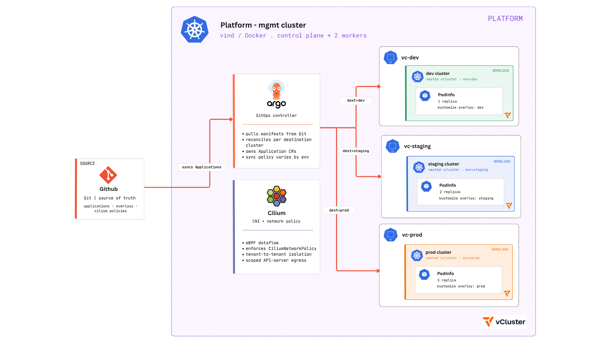

# Vind GitOps Platform — Multi-Tenant vCluster Environments with ArgoCD + Cilium

A local, from-scratch GitOps platform: one management cluster running ArgoCD and Cilium, three nested vcluster tenants (dev, staging, prod), and a single app-of-apps root that reconciles all of it from Git.



## What this includes

- App-of-apps pattern with ArgoCD, fanning out to multiple cluster destinations
- Real tenant isolation via nested vclusters, not simulated namespaces
- Differentiated sync policy per environment (auto+self-heal → auto → manual promotion gate)
- Network-layer tenant isolation with Cilium (CiliumNetworkPolicy), enforced via eBPF
- Manifest validation in CI before anything reaches the reconciliation loop

## Architecture

A `vind` (vCluster-in-Docker) cluster acts as the management plane: one control plane, two workers, hosting ArgoCD and Cilium. Three tenant vclusters:  `dev`, `staging`, `prod` are deployed as nested control planes inside that same cluster (via vCluster's `helm` driver, not standalone Docker instances). ArgoCD registers each as a remote destination and reconciles a `guestbook` workload into each one from a Kustomize overlay, differing only in replica count.

## A Hybrid approach to GitOps 

We implemented a three tier enviroment to demonstarte a hybrid approach in GitOps that offers both "automated" and "manual" syncs. It is a practical pattern that acknowledges real operational constraints rather than chasing full automation for its own sake.

 The hybrid model discussed reflects what most teams actually land on: auto-sync in dev and staging for fast feedback, manual sync in production for control.

| Environment | Sync policy | Replicas |
|---|---|---|
| dev | automated, self-heal, prune | 1 |
| staging | automated, prune (no self-heal) | 2 |
| prod | manual only — sits `OutOfSync` until approved | 3 |

## Cilium over the default CNI
We opted for cilium as a CNI in place of Flannel that comes out of the box for two reasons: nested vcluster networking already stacks several overlay layers (Docker bridge → host CNI → vcluster's synced pod network), and flannel adds a fourth with no way to enforce policy on top of it. 

Cilium collapses that stack with flat, eBPF-backed IPAM and gives the project an actual enforcement point for tenant isolation, with faster networking, better observability, and a single component instead of two.

## Repository structure

```
gitops-platform-demo/
├── clusters/
│   └── vind-platform/
│       └── root-app.yaml              # the only manifest ever applied by hand
├── apps/
│   ├── platform/
│   │   ├── cilium-policies/           # CiliumNetworkPolicy, per tenant namespace
│   │   └── platform-appset/           # Application → destination: in-cluster (host)
│   ├── guestbook/
│   │   ├── base/
│   │   └── overlays/{dev,staging,prod}/
│   └── guestbook-app-set/
│       ├── dev.yaml                   # automated, selfHeal, prune
│       ├── staging.yaml               # automated, prune
│       └── prod.yaml                  # no automated block — manual sync
└── .github/workflows/
    └── kustomize-validate.yaml        # kustomize build + kubeconform on every PR
```

## What's manual vs. what ArgoCD manages

Everything up to the point where a Git repo and a reachable cluster both exist is necessarily manual. ArgoCD can't manage the scaffolding that gives it something to read from and somewhere to act. That covers: creating the vind cluster, installing ArgoCD itself, creating the three tenant vclusters, and registering them (`argocd cluster add`). One manual `kubectl apply -f root-app.yaml` is the last hands-on step.

From there, ArgoCD owns: discovering the child Applications under `apps/`, syncing each overlay into its tenant, correcting drift according to each environment's sync policy, and rollback via `git revert`. Nothing downstream of the root app is ever touched with `kubectl apply` again.

## Known limitations / next steps
- **Sveltos, as a complement to ArgoCD Applications for the fan-out layer.** Sveltos targets clusters by label rather than by hardcoded destination server, which would remove the need to hand-write a separate Application per tenant. This is worth evaluating once a fourth or fifth environment makes that manual duplication actually painful.

## Reproducing this locally

Built and tested on WSL2 + Docker Desktop, which has its own set of networking quirks. A full walkthrough with the specific workarounds required for that setup is written up here: **[link to Medium article will be added shorty]**.

Condensed sequence:

`vind-cilium.yaml`

```yaml
experimental:
  docker:
    nodes:
      - name: "worker-1"
      - name: "worker-2"
deploy:
  kubeProxy:
    enabled: false   # Cilium will replace kube-proxy
  cni:
    flannel:
      enabled: false  # Cilium will replace Flannel
```

```bash
# create platform vind cluster
vcluster create platform --driver docker -f vind-cilium.yaml

# find API server IP and PORT
kubectl get endpoints kubernetes -n default

# configure cilium as cni
helm repo add cilium <https://helm.cilium.io>
helm repo update
helm install cilium cilium/cilium \
  --version 1.16.0 \
  --namespace kube-system \
  --set kubeProxyReplacement=true \
  --set k8sServiceHost=<API SERVER IP> \
  --set k8sServicePort=<PORT> \
  --set image.pullPolicy=IfNotPresent \
  --set ipam.mode=kubernetes \
  --set envoy.enabled=false

# configure Argocd
kubectl create namespace argocd
kubectl apply -n argocd -f https://raw.githubusercontent.com/argoproj/argo-cd/stable/manifests/install.yaml

#create the nested vclusters
vcluster create dev     --driver helm -n vc-dev
vcluster create staging --driver helm -n vc-staging
vcluster create prod    --driver helm -n vc-prod

# argocd cluster add for each tenant context

# git push, then:
kubectl apply -f clusters/vind-platform/root-app.yaml
```